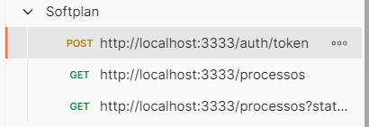
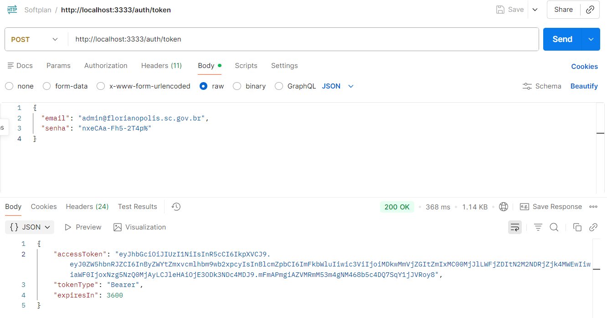
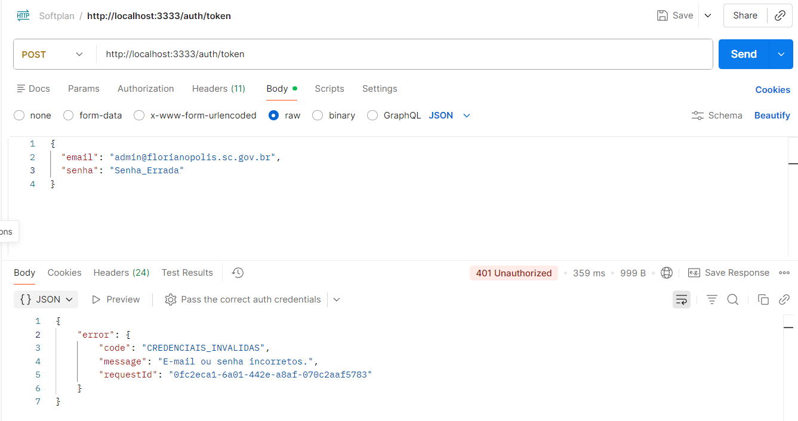
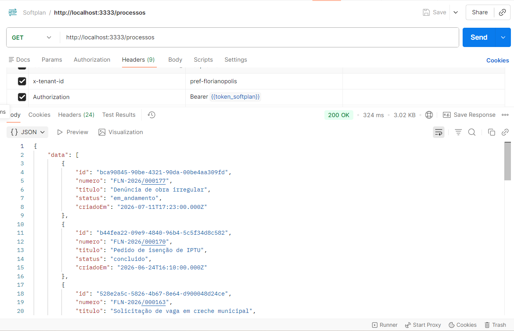
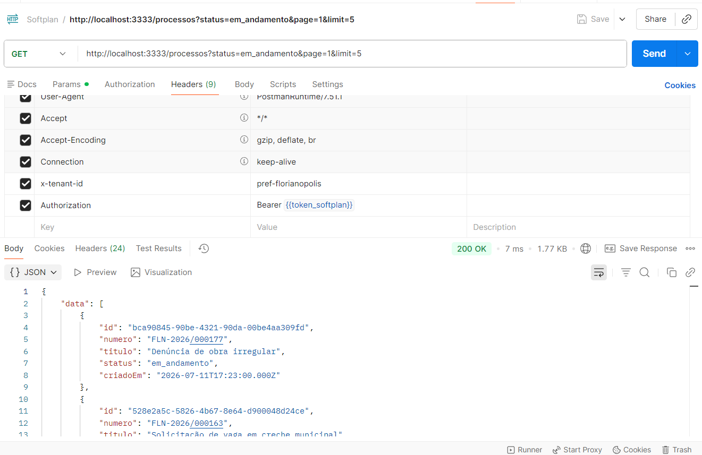
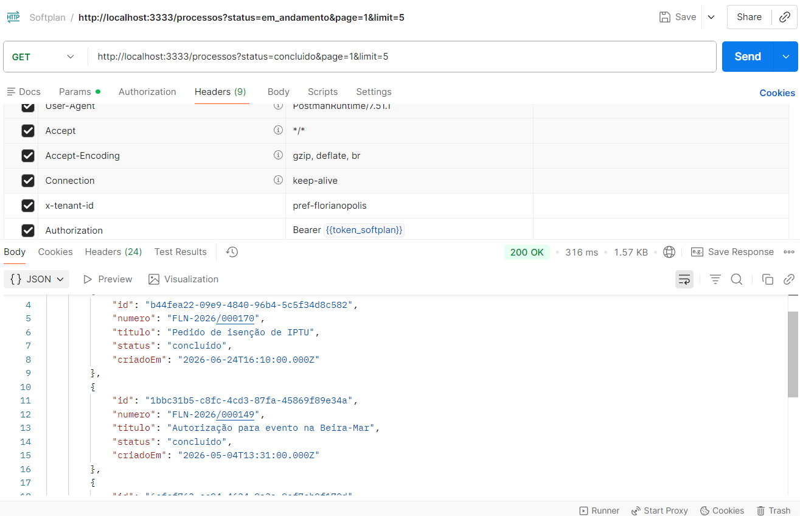
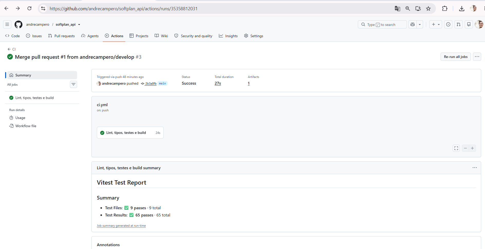
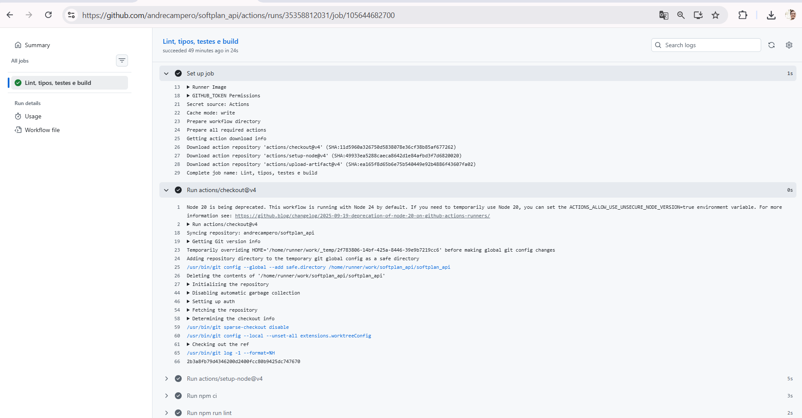

# softplan_api — 1DOC: nova camada de API

## 1. Objetivo

O **1DOC** é uma plataforma SaaS de gestão de documentos e trâmites usada por governos
municipais e estaduais. O backend legado (monolito PHP + MySQL, um banco por cliente) é
rígido e tem regras de negócio acopladas.

Este repositório é a **fundação da nova camada de API**, que permite a governos conectar
sistemas externos de forma **segura, escalável e multitenant**, sem reescrever o legado de
uma vez (*Strangler Fig*). Ela entrega um contrato OpenAPI consumido pelo frontend
([softplan_web](https://github.com/andrecampero/softplan_web)).

Hoje os dados são **mockados em memória**, com uma base separada por cliente (tenant).

> Regras de arquitetura, convenções e o passo a passo para criar endpoints estão no
> [CLAUDE.md](CLAUDE.md). Leia antes de alterar o código.

## 2. Escopo do teste técnico

Este repositório responde ao **Desafio 1 — Fundação da Nova API** do teste técnico
(Engenheiro de Software Full Stack). A interface do Desafio 2 está em
[softplan_web](https://github.com/andrecampero/softplan_web).

### O que o desafio pede e onde está

| Requisito do enunciado | Como foi atendido |
|---|---|
| Stack TypeScript / Node.js | TypeScript strict + Node 22 + Fastify 5 |
| Clean ou Hexagonal Architecture, com justificativa | **Hexagonal (Ports & Adapters)**; justificativa na seção 3 do [CLAUDE.md](CLAUDE.md) |
| Camadas mínimas: domínio, aplicação e infraestrutura | `src/domain`, `src/application`, `src/infrastructure` (+ `src/main` como composition root); a separação é verificada pelo ESLint |
| `GET /processos` com `x-tenant-id` obrigatório (400 se ausente) | ✅ `400 TENANT_ID_OBRIGATORIO` |
| Filtro `?status=em_andamento\|concluido` | ✅ (valor inválido → 400) |
| Resposta `{ data, total, page }` | ✅ exatamente esse formato |
| Dados mockados em memória | ✅ uma base separada por cliente (tenant) |
| Tenant validado antes da lógica de negócio | ✅ hook `onRequest` do Fastify, antes do Service; um teste prova que o Service não é chamado |
| `CLAUDE.md` com arquitetura, convenções, estrutura e passo a passo de novo endpoint | ✅ [CLAUDE.md](CLAUDE.md), com a especificação completa do `GET /contatos` (seção 10) |
| Teste unitário do caso de uso central | ✅ `ListarProcessosService` (equivale ao `ListarProcessosUseCase` do enunciado): filtro, paginação, ordenação e **isolamento entre tenants** |
| Contrato de API consumível pelo frontend | ✅ OpenAPI em `/docs` e em `openapi.json`, do qual o frontend gera seus tipos |

### O que foi além do pedido

| Item | Motivo |
|---|---|
| Autenticação (`POST /auth/token`, JWT de 1 h) | API aberta a sistemas externos de governo não pode confiar só em um header. O 400 sem tenant continua valendo, porque o tenant é validado antes do token |
| Senhas com hash `scrypt`, lidas do `.env` | Nenhuma credencial no código |
| Rate limit em camadas (IP, usuário, login) | Protege contra abuso sem bloquear servidores que saem pelo mesmo IP da prefeitura |
| Erros com mensagem amigável + `requestId` | O cliente recebe texto claro; o detalhe técnico vai só para `logs/log_api.log` |
| 65 testes (unitários + integração), cobertura de linhas ~98% | TDD; os testes rodam sem `.env` e sem rede |
| **Git e CI/CD** | `.gitignore` (bloqueia `.env`, logs, PDFs, planilhas, imagens); **GitHub Actions** em `.github/workflows/ci.yml` roda lint, tipos, testes com cobertura mínima de 80% e build a cada push e Pull Request na `main` |

### Fora do escopo, de propósito

O enunciado não pede **upload de arquivos** nem **endpoint de detalhe**
(`GET /processos/:id`), e diz que "o objetivo não é terminar o sistema". Os Anexos aparecem
só no contexto do problema. Os caminhos já estão planejados no [CLAUDE.md](CLAUDE.md):
novos endpoints pela seção 10 e upload por URLs pré-assinadas do S3, sem o arquivo passar
pela API. O `GET /contatos` foi deixado de fora para servir de teste do critério de
*AI-readiness*.

## 3. Stack

Node.js 22 (ver `.nvmrc`) · TypeScript · Fastify 5 · Zod 4 · JWT (`jose`) · `scrypt`
(`node:crypto`) · `@fastify/rate-limit` · pino · Vitest · ESLint.

## 4. Pré-requisitos

- Node.js 22 e npm.
- Não é preciso Docker nem banco de dados.

## 5. Como subir

```bash
npm install
npm run setup        # gera o .env com JWT_SECRET e senhas aleatórias e as exibe UMA vez
npm run dev          # http://localhost:3333
```

- Documentação interativa (Swagger): http://localhost:3333/docs
- Healthcheck: http://localhost:3333/health

Prefere preencher manualmente? `cp .env.example .env` e troque cada `troque-me`:

| Variável | Para quê |
|---|---|
| `PORT`, `HOST` | Porta e interface do servidor (padrão 3333 / 0.0.0.0) |
| `CORS_ORIGIN` | Origens do frontend liberadas (padrão `http://localhost:5173`) |
| `JWT_SECRET` | Segredo do token, **mínimo 32 caracteres**. Gere com `node -e "console.log(require('crypto').randomBytes(48).toString('base64'))"` |
| `RATE_LIMIT_*` | Limites por minuto: IP (600), usuário (120), login por conta (5), login por origem (30) |
| `LOG_FILE`, `LOG_LEVEL` | Arquivo de log de erros (`logs/log_api.log`) e nível do console |
| `MOCK_SENHA_*` | Senha de cada usuário mock (mínimo 8 caracteres) |

A API **não sobe** se faltar alguma variável ou se ainda houver `troque-me`, e o console
lista quais variáveis corrigir.

## 6. Como testar

```bash
npm test             # testes em modo watch
npm run test:ci      # todos os testes + cobertura (igual ao CI)
npm run lint
npm run typecheck
```

Fluxo manual com `curl`: primeiro obtenha o token, depois consulte. A senha é lida do
`.env`; nunca a escreva em arquivos.

```bash
SENHA=$(grep ^MOCK_SENHA_FLORIANOPOLIS_ADMIN .env | cut -d= -f2-)

TOKEN=$(curl -s -X POST http://localhost:3333/auth/token \
  -H 'content-type: application/json' -H 'x-tenant-id: pref-florianopolis' \
  -d "{\"email\":\"admin@florianopolis.sc.gov.br\",\"senha\":\"$SENHA\"}" \
  | node -pe 'JSON.parse(require("fs").readFileSync(0)).accessToken')

curl -s "http://localhost:3333/processos?status=em_andamento" \
  -H 'x-tenant-id: pref-florianopolis' -H "authorization: Bearer $TOKEN"
```

Após mudar um endpoint, atualize o contrato com `npm run openapi:export`, que gera
`openapi.json`.

## 7. Estrutura de pastas

```
src/domain/          entidades, ports (interfaces) e erros; sem dependências externas
src/application/     Services: toda regra de negócio e fluxo
src/infrastructure/  Fastify (rotas, schemas, plugins), JWT, scrypt, logs, mocks em memória
src/main/            config (.env), composition root e bootstrap
test/integration/    testes HTTP com app.inject()
scripts/             setup do .env e exportação do OpenAPI
```

Arquitetura hexagonal (Ports & Adapters). Detalhes e justificativa no [CLAUDE.md](CLAUDE.md).

## 8. Tenants e usuários mock

Cada cliente tem sua própria base em
`src/infrastructure/persistence/in-memory/seed/tenants/<tenant-id>/`.

| Tenant (`x-tenant-id`) | E-mail | Variável da senha no `.env` | Observação |
|---|---|---|---|
| `pref-florianopolis` | admin@florianopolis.sc.gov.br | `MOCK_SENHA_FLORIANOPOLIS_ADMIN` | 12 processos |
| `pref-florianopolis` | servidor@florianopolis.sc.gov.br | `MOCK_SENHA_FLORIANOPOLIS_SERVIDOR` | |
| `pref-joinville` | admin@joinville.sc.gov.br | `MOCK_SENHA_JOINVILLE_ADMIN` | 7 processos |
| `pref-joinville` | inativo@joinville.sc.gov.br | `MOCK_SENHA_JOINVILLE_INATIVO` | usuário inativo: o login falha |
| `gov-sc` | admin@sc.gov.br | `MOCK_SENHA_GOVSC_ADMIN` | nenhum processo (lista vazia) |

O token expira em **1 hora**.

## 9. Erros e logs

Todo erro segue um único formato, com mensagem amigável em pt-BR:

```json
{ "error": { "code": "TOKEN_EXPIRADO", "message": "Sua sessão expirou. Faça login novamente.", "requestId": "9f1c…" } }
```

Os erros são gravados em `logs/log_api.log`, uma linha JSON por erro: `warn` para 4xx e
`error` para 5xx, com stack. Senhas e tokens nunca são gravados. Para rastrear um erro
relatado por um usuário, procure o `requestId`:

```bash
grep '"requestId":"9f1c' logs/log_api.log
```

## 10. Solução de problemas

| Sintoma | Causa / solução |
|---|---|
| `A API não foi iniciada. Configuração inválida no .env` | Rode `npm run setup` ou corrija as variáveis listadas |
| `EADDRINUSE :3333` | Porta ocupada: altere `PORT` no `.env` ou encerre o outro processo |
| Frontend com erro de CORS | Confira se `CORS_ORIGIN` contém a URL do frontend |
| `429 RATE_LIMIT_EXCEDIDO` em testes manuais | Aguarde o tempo indicado em `retryAfterSeconds` ou aumente `RATE_LIMIT_*` no `.env` local |
| `401 CREDENCIAIS_INVALIDAS` com a senha certa | A senha precisa ser igual à do `.env` **atual**; após `npm run setup -- --force`, as senhas mudam |
| `403 TENANT_TOKEN_DIVERGENTE` | O token foi emitido para outro tenant: faça login no órgão do header `x-tenant-id` |

## 11. Telas e evidências

Testes manuais da API no Postman, com a API rodando localmente (`npm run dev`). As imagens
ficam em [`docs/imgs/`](docs/imgs), a única pasta do repositório onde imagens podem ser
versionadas.

### Collection usada nos testes
Os três requests do fluxo: obter o token e depois consultar os processos, com e sem filtro.



### 1. Autenticação: `POST /auth/token` → 200
Com `x-tenant-id: pref-florianopolis`, e-mail e senha válidos, a API devolve o token
`Bearer`, válido por 1 hora (`expiresIn: 3600`).



### 2. Autenticação com senha errada → 401
Resposta genérica e amigável (`CREDENCIAIS_INVALIDAS`, "E-mail ou senha incorretos."), que
não revela se o e-mail existe, e com `requestId` para rastrear no log.



### 3. Listagem: `GET /processos` → 200
Com os headers `x-tenant-id` e `Authorization: Bearer <token>`, a API devolve o contrato
`{ data, total, page }` só com os processos do órgão, do mais recente para o mais antigo.



### 4. Filtro por status "em andamento" com paginação
`?status=em_andamento&page=1&limit=5`



### 5. Filtro por status "concluído"
`?status=concluido&page=1&limit=5`



### 6. CI no GitHub Actions: pipeline verde
O workflow `CI` (`.github/workflows/ci.yml`) rodou no merge do PR #1 (`develop` → `main`):
o job **"Lint, tipos, testes e build"** passou em 27 s, e o relatório do Vitest mostra
**9 arquivos de teste e 65 testes passando**. O relatório de cobertura fica disponível como
artefato do run.



### 7. CI: detalhes da execução
Log das etapas do job: preparação do runner, checkout, setup do Node (versão do `.nvmrc`),
`npm ci`, lint, typecheck, testes com cobertura e build. Qualquer etapa com falha bloqueia
o merge na `main` quando a proteção da branch está ativa.


